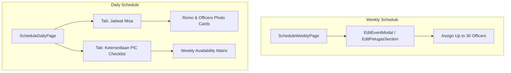

# Schedule Features Enhancements Design Spec

**Date:** 2026-08-12  
**Topic:** Weekly Schedule Max Officers Expansion, Daily Mass Romo & Officer Photo Input, and Daily PIC Monthly Availability Checklist Tab  

---

## 1. Overview & Context

This design document outlines three major feature additions for the Church Management Application (`SigmaNEW`):

1. **Dynamic Max Officers Limit for Weekly Schedule & Special Masses**: Allow event editors to expand assignment limits per slot up to a maximum of 30 officers (with slot capacity counter and dynamic slot management).
2. **Enhanced Romo & Daily Officer Photo Display/Input for Daily Mass (`Misa Harian`)**: Modernize the PIC and Officer management UI with visual avatar cards, Romo photo input/selection, and liturgy-themed badges.
3. **Monthly PIC Availability Checklist Tab (`Penjadwalan PIC Harian`)**: A new tab in the Daily Schedule page allowing officers (especially those studying in Solo or with travel constraints) to submit weekly availability for the month, enabling easy filtering for schedulers.

---

## 2. Detailed Specifications

### Feature A: Weekly Schedule Max Officers Capacity (Up to 30 Limit)
- **Target Files**: `src/pages/schedule/components/ScheduleModals.tsx`, `src/pages/schedule/components/AddMisaModal.tsx`, `src/pages/schedule/ScheduleWeeklyPage.tsx`
- **Functional Requirements**:
  - Add `jumlah_petugas` capacity setting in event edit & creation modal with min 1 and max 30 limit.
  - Show real-time filled ratio badge (e.g. `12 / 25 Petugas (Maks. 30)`).
  - In `EditPetugasSection`, support selecting up to the target limit without artificial soft caps below 30.
  - Warn users when adding officers beyond 30 with a high-visibility badge or tooltip.

### Feature B: Daily Mass Romo & Officer Photo Input & Cards
- **Target Files**: `src/pages/ScheduleDailyPage.tsx`
- **Functional Requirements**:
  - Add Romo (Celebrant Priest) selection and photo preview input field in the daily event modal (`romo_nama`, `romo_foto_url`).
  - Render daily officers and Romo using sleek UI avatar cards featuring:
    - Liturgical season themed border / glow (Green, Red, White, Purple, Rose, Black).
    - Romo portrait card with cassock/liturgical badge.
    - Officers avatar grid with fallback initials or user photo from `foto_url`.
  - Provide a quick officer picker with user search and instant photo preview.

### Feature C: Monthly PIC Availability Checklist Tab (`Ketersediaan PIC`)
- **Target Files**: `src/pages/ScheduleDailyPage.tsx`
- **Data Model**:
  - Local/Supabase state table or fallback structure for `misa_harian_pic_availability`:
    - `user_id`: string
    - `tahun`: number
    - `bulan`: number
    - `pekan_1_bisa`: boolean / string ('Bisa' | 'Solo/Tidak' | 'AkhirPekanOnly')
    - `pekan_2_bisa`: boolean / string
    - `pekan_3_bisa`: boolean / string
    - `pekan_4_bisa`: boolean / string
    - `pekan_5_bisa`: boolean / string
    - `catatan`: string (e.g., "Kuliah di Solo, pulang minggu ke-3")
- **UI Components**:
  - Tab header button: `Ketersediaan PIC (Checklist)`.
  - Matrix table / Card list showing each user with 5 weekly checkboxes/toggles for the selected month.
  - Status badges: 🟢 Available, 🟡 Weekend Only, 🔴 Di Solo / Tidak Bisa, 🏖️ Libur.
  - Filter by status (e.g. "Hanya yang bisa Pekan 2").
  - Self-update panel for logged in user + Pengurus override edit panel.

---

## 3. Architecture & Data Flow

---

## 4. Verification Plan

1. **Manual Testing**:
   - Open Weekly Schedule -> Edit event -> Change max officers to 30 -> Add multiple officers -> Save & verify count.
   - Open Daily Schedule -> Edit Daily Mass -> Add Romo photo & Officers -> Verify visual cards display.
   - Open Ketersediaan PIC tab -> Toggle weekly checkboxes for Solo/Availability -> Verify persistence and summary filter.
2. **Automated / Build Verification**:
   - Run TypeScript type check (`npx tsc --noEmit` or Vite build) to verify no type or import errors.
